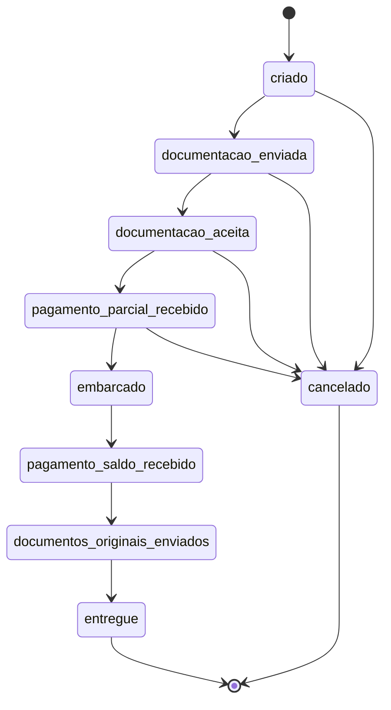

PRD — Sistema de Rastreamento de Pedidos de Exportação
1. Sumário executivo
Sistema de rastreamento do ciclo de vida de pedidos de exportação de commodity (proteína animal), do lado do fornecedor. Modela como estado real de negócio o fluxo entre acordo comercial, trâmite documental, pagamentos parciais e embarque — domínio extraído da experiência prática do autor em comércio exterior, não um CRUD genérico.
Serve dois propósitos: (1) ferramenta real de rastreio de processo por número do pedido (PO); (2) projeto-bandeira de portfólio para transição de carreira a QA Automation + AI Engineering, com cobertura de testes unitários, API e E2E, e um módulo de IA para triagem de resultados de teste (este último especificado em fase posterior, fora deste PRD).
2. Problema
No comércio exterior de commodities, o fornecedor negocia por telefone, gera um pedido, e a partir daí depende de trâmites sequenciais e sensíveis a tempo (envio e aceite de documentos, pagamento parcial, embarque, pagamento de saldo, entrega) para não incorrer em prejuízo — seja por atraso documental (custo de demurrage), seja por cancelamento tardio do cliente (perda de margem em revenda).
Hoje esse rastreio depende de memória e comunicação informal, sem registro estruturado de quando cada etapa ocorreu nem histórico de transições que evidencie responsabilidade (ex: "documentação foi enviada em tempo hábil, atraso não foi do fornecedor").
3. Oportunidade
Um sistema com máquina de estados explícita, transições validadas e histórico auditável resolve isso sem precisar codificar regras de severidade de negócio — a gravidade de um cancelamento, por exemplo, já fica evidente ao ver de qual estado ele partiu. O domínio tem transições de estado reais o suficiente para gerar edge cases genuínos, o que o torna um caso de teste substancial (unitário, API, E2E) — center da segunda motivação do projeto.
4. Audiência
Uso individual pelo fornecedor (o próprio autor, no papel do lado comercial da exportação). Sem multiusuário no v1. Localização de processo por número do pedido (PO). O cliente final não é usuário do sistema — sem login, sem acesso direto; recebe informação de status via o PDF gerado pelo fornecedor (F03), não interage com a aplicação.
5. Objetivos e métricas

* Todo pedido tem seu ciclo de vida completo rastreável, do `criado` ao `entregue` (ou `cancelado`), com histórico de transições íntegro.
* Nenhuma transição de estado inválida é aceita silenciosamente — toda tentativa inválida é rejeitada de forma explícita.
* Checklist documental impede avanço de estado sem os documentos obrigatórios aceitos pelo cliente.
* Cobertura de teste real (não simulada) nas regras de transição — métrica de sucesso do projeto como peça de portfólio, não do sistema em si.

6. Features
F01 — Ciclo de vida do pedido de exportação
Cobre criação do pedido, consulta por número do pedido (PO), checklist documental e todas as transições de estado do fluxo abaixo.
Máquina de estados:

Regras de negócio:

* Cancelamento permitido em qualquer estado anterior a `embarcado`; proibido a partir de `embarcado` (inclusive).
* Toda transição gera um registro de histórico: estado anterior, estado novo, timestamp. Não é campo derivado — é o mecanismo que evidencia em que ponto um cancelamento ocorreu, sem regra de severidade codificada à parte.
* Avanço de `documentacao_enviada` → `documentacao_aceita` exige que todos os itens obrigatórios do checklist tenham `aceito_em` preenchido.
* Transição fora da sequência definida é rejeitada explicitamente (erro de domínio, nunca falha silenciosa).

Checklist documental: 4 itens fixos e obrigatórios (invoice, packing list, BL, certificado sanitário) mais um 5º item opcional — "documento adicional", para exigências específicas de país de destino. Cada item tem `enviado_em` e `aceito_em` (ambos opcionais até preenchidos, nessa ordem; sem geração de arquivo, é controle booleano com data). Propósito declarado: evidenciar prazo de envio para defesa em caso de demurrage no destino. Existe também um registro de ocorrências (`pedido_ocorrencia`) para dois eventos que geram atraso/custo e precisam de motivo documentado: reabertura de documento já aceito, e alteração de dados do pedido pós-embarque (ex: troca de consignee) — ambos com motivo obrigatório.
Pagamento (modelo CFR, sem cálculo de valor/moeda): dois marcos booleanos com timestamp — `pagamento_parcial_confirmado_em`, `pagamento_saldo_confirmado_em`.
Campos do pedido:

* Número do pedido (PO) — chave de negócio, único, atribuído na abertura da negociação, antes de qualquer documento
* Cliente (comprador) e Consignee (destinatário no BL — podem ser partes diferentes; consignee pode mudar após o embarque)
* País de destino, porto de origem, porto de destino
* Produto (descrição da mercadoria), quantidade, unidade de medida
* Companhia marítima e número do container
* Preço acordado, moeda, Incoterm (os 11 termos do Incoterms 2020)
* Forma de pagamento (carta de crédito, TT antecipado, TT contra documentos, cobrança documentária) e percentual do pagamento antecipado (o saldo é 100% menos esse percentual)

F02 — Painel do fornecedor (frontend)
Interface web (React + TypeScript) para o fornecedor operar o ciclo de vida do pedido sem depender de chamadas HTTP diretas. Três telas:

* Lista de pedidos: tabela com número, cliente, consignee, descrição, companhia marítima, estado, última atualização; filtro por estado.
* Criar pedido: formulário com os dados do PO, agrupados por identificação, descrição da mercadoria, logística e condições comerciais.
* Detalhe do pedido: checklist documental (enviar/aceitar/reabrir por item), histórico de transições, ações de ciclo de vida (transicionar, confirmar pagamento parcial/saldo, cancelar), e geração de PDF de status.

Sem autenticação nesta leva — uso de um único operador (o fornecedor), mesma decisão já registrada pra F01 (seção 4). Login fica condicionado ao item "Multiempresa" do backlog v2, quando houver de fato mais de um usuário.

F03 — PDF de status do pedido
Documento gerado sob demanda (botão no painel), com visual de progresso por etapas (inspirado em rastreio de transportadora — DHL, Correios), refletindo o estado do pedido no momento da geração — não é um link vivo, é uma fotografia.

Decisão de substituir a ideia original de link de rastreio público e dinâmico: um PDF sob demanda não exige nenhuma rota pública nem proteção de escrita da API, resolve a necessidade real do cliente (saber o status) sem expor a aplicação. Envio automático por e-mail a cada mudança de estado é evolução natural desta feature, mas fica registrado no backlog v2 — depende de integração de e-mail, que não existe ainda.

7. User stories

* Como fornecedor, quero criar um pedido de exportação com os dados acordados na negociação, para iniciar o rastreio do processo.
* Como fornecedor, quero consultar um pedido pelo número do pedido (PO), para acompanhar seu estado atual sem depender de memória.
* Como fornecedor, quero marcar cada documento do checklist como enviado e depois como aceito pelo cliente, para ter evidência de prazo em caso de disputa de demurrage.
* Como fornecedor, quero que o sistema rejeite uma transição de estado fora de sequência, para não registrar um processo em estado inconsistente com a realidade.
* Como fornecedor, quero ver o histórico completo de transições de um pedido, para entender em que ponto exato um cancelamento ocorreu.
* Como fornecedor, quero operar o ciclo de vida do pedido por uma interface web, sem precisar montar requisições HTTP manualmente.
* Como fornecedor, quero gerar um PDF do status atual de um pedido, para enviar ao cliente de forma profissional sem expor o sistema publicamente.

8. Consumes / Provides
F01 é a feature-fundação deste PRD. F02 (painel do fornecedor) consome a API de F01 via chamadas HTTP — é a única forma de operar o ciclo de vida pela interface, não um caminho paralelo de regras de negócio. F03 (PDF de status) consome o estado atual do pedido e o histórico de transições expostos por F01, acionado a partir de F02. Módulo de IA (triagem de testes) e camadas de teste (JUnit/API/E2E/CI) consomem o comportamento de F01 como sujeito de teste, mas são especificados na fase de Spec, não como feature de produto deste PRD.
9. Fora de escopo (v1)

* Autenticação e autorização multiusuário (ex: papel de gerente consultando embarques) — segue fora de escopo, sem mudança; fase 2, decisão explícita de adiamento, não esquecimento.
* Geração de arquivo pros documentos do checklist em si (invoice, packing list, BL, certificado sanitário) — cada item continua sendo controle booleano com data (`enviado_em`/`aceito_em`), nunca um upload ou arquivo gerado. Distinto do PDF de status (F03): esse não é um documento do checklist, é um retrato do estado do pedido, gerado à parte, sob demanda.
* Link de rastreio dinâmico/público para o cliente — avaliado e descartado em favor do PDF sob demanda (F03); reabre se um dia o custo de manter isso manual disputar espaço.
* Envio automático de notificação por e-mail — depende de F03 existir primeiro; registrado no backlog v2.
* Cálculo de valores/moeda de pagamento — apenas dois marcos de confirmação.
* Negociação comercial (fase de telefone) — ocorre fora do sistema; o pedido já nasce com acordo fechado.
* Módulo de triagem por IA e camadas de teste — especificados separadamente na Spec, não fazem parte das features de produto deste PRD.

Assumption marcada para revisão: lista de documentos obrigatórios do checklist (invoice, packing list, BL, certificado sanitário) tratada como fixa para o v1. Se o domínio exigir lista variável por tipo de carga/destino, isso é ajuste de Spec, não de PRD.
