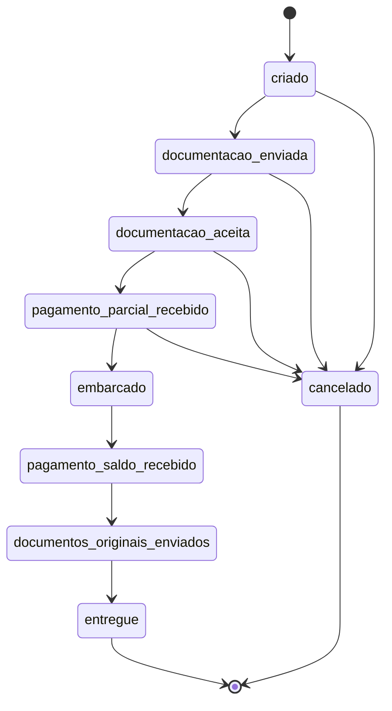

PRD — Sistema de Rastreamento de Pedidos de Exportação
1. Sumário executivo
Sistema de rastreamento do ciclo de vida de pedidos de exportação de commodity (proteína animal), do lado do fornecedor. Modela como estado real de negócio o fluxo entre acordo comercial, trâmite documental, pagamentos parciais e embarque — domínio extraído da experiência prática do autor em comércio exterior, não um CRUD genérico.
Serve dois propósitos: (1) ferramenta real de rastreio de processo por número de invoice; (2) projeto-bandeira de portfólio para transição de carreira a QA Automation + AI Engineering, com cobertura de testes unitários, API e E2E, e um módulo de IA para triagem de resultados de teste (este último especificado em fase posterior, fora deste PRD).
2. Problema
No comércio exterior de commodities, o fornecedor negocia por telefone, gera um pedido, e a partir daí depende de trâmites sequenciais e sensíveis a tempo (envio e aceite de documentos, pagamento parcial, embarque, pagamento de saldo, entrega) para não incorrer em prejuízo — seja por atraso documental (custo de demurrage), seja por cancelamento tardio do cliente (perda de margem em revenda).
Hoje esse rastreio depende de memória e comunicação informal, sem registro estruturado de quando cada etapa ocorreu nem histórico de transições que evidencie responsabilidade (ex: "documentação foi enviada em tempo hábil, atraso não foi do fornecedor").
3. Oportunidade
Um sistema com máquina de estados explícita, transições validadas e histórico auditável resolve isso sem precisar codificar regras de severidade de negócio — a gravidade de um cancelamento, por exemplo, já fica evidente ao ver de qual estado ele partiu. O domínio tem transições de estado reais o suficiente para gerar edge cases genuínos, o que o torna um caso de teste substancial (unitário, API, E2E) — center da segunda motivação do projeto.
4. Audiência
Uso individual pelo fornecedor (o próprio autor, no papel do lado comercial da exportação). Sem multiusuário no v1. Localização de processo por número de invoice.
5. Objetivos e métricas

* Todo pedido tem seu ciclo de vida completo rastreável, do `criado` ao `entregue` (ou `cancelado`), com histórico de transições íntegro.
* Nenhuma transição de estado inválida é aceita silenciosamente — toda tentativa inválida é rejeitada de forma explícita.
* Checklist documental impede avanço de estado sem os documentos obrigatórios aceitos pelo cliente.
* Cobertura de teste real (não simulada) nas regras de transição — métrica de sucesso do projeto como peça de portfólio, não do sistema em si.

6. Features
F01 — Ciclo de vida do pedido de exportação
Cobre criação do pedido, consulta por número de invoice, checklist documental e todas as transições de estado do fluxo abaixo.
Máquina de estados:

Regras de negócio:

* Cancelamento permitido em qualquer estado anterior a `embarcado`; proibido a partir de `embarcado` (inclusive).
* Toda transição gera um registro de histórico: estado anterior, estado novo, timestamp. Não é campo derivado — é o mecanismo que evidencia em que ponto um cancelamento ocorreu, sem regra de severidade codificada à parte.
* Avanço de `documentacao_enviada` → `documentacao_aceita` exige que todos os itens obrigatórios do checklist tenham `aceito_em` preenchido.
* Transição fora da sequência definida é rejeitada explicitamente (erro de domínio, nunca falha silenciosa).

Checklist documental (tipos fixos, sem geração de arquivo): invoice, packing list, BL, certificado sanitário [+ ajustáveis]. Cada item tem `enviado_em` e `aceito_em` (ambos opcionais até preenchidos, nessa ordem). Propósito declarado: evidenciar prazo de envio para defesa em caso de demurrage no destino.
Pagamento (modelo CFR, sem cálculo de valor/moeda): dois marcos booleanos com timestamp — `pagamento_parcial_confirmado_em`, `pagamento_saldo_confirmado_em`.
Campos do pedido:

* Número de invoice (chave de negócio, único)
* Cliente (nome/empresa)
* País/porto de destino
* Produto (tipo de commodity)
* Quantidade/peso
* Companhia marítima e número do container
* Preço acordado (CFR)

7. User stories

* Como fornecedor, quero criar um pedido de exportação com os dados acordados na negociação, para iniciar o rastreio do processo.
* Como fornecedor, quero consultar um pedido pelo número de invoice, para acompanhar seu estado atual sem depender de memória.
* Como fornecedor, quero marcar cada documento do checklist como enviado e depois como aceito pelo cliente, para ter evidência de prazo em caso de disputa de demurrage.
* Como fornecedor, quero que o sistema rejeite uma transição de estado fora de sequência, para não registrar um processo em estado inconsistente com a realidade.
* Como fornecedor, quero ver o histórico completo de transições de um pedido, para entender em que ponto exato um cancelamento ocorreu.

8. Consumes / Provides
F01 é a única feature de produto deste PRD — não há dependência cruzada a resolver nesta fase. Módulo de IA (triagem de testes) e camadas de teste (JUnit/API/E2E/CI) consomem o comportamento de F01 como sujeito de teste, mas são especificados na fase de Spec, não como feature de produto deste PRD.
9. Fora de escopo (v1)

* Autenticação e autorização multiusuário (ex: papel de gerente consultando embarques) — fase 2, decisão explícita de adiamento, não esquecimento.
* Geração real de documentos (PDF de invoice, BL, etc.) — checklist é booleano com datas, não geração de arquivo.
* Cálculo de valores/moeda de pagamento — apenas dois marcos de confirmação.
* Negociação comercial (fase de telefone) — ocorre fora do sistema; o pedido já nasce com acordo fechado.
* Módulo de triagem por IA e camadas de teste — especificados separadamente na Spec, não fazem parte das features de produto deste PRD.

Assumption marcada para revisão: lista de documentos obrigatórios do checklist (invoice, packing list, BL, certificado sanitário) tratada como fixa para o v1. Se o domínio exigir lista variável por tipo de carga/destino, isso é ajuste de Spec, não de PRD.
